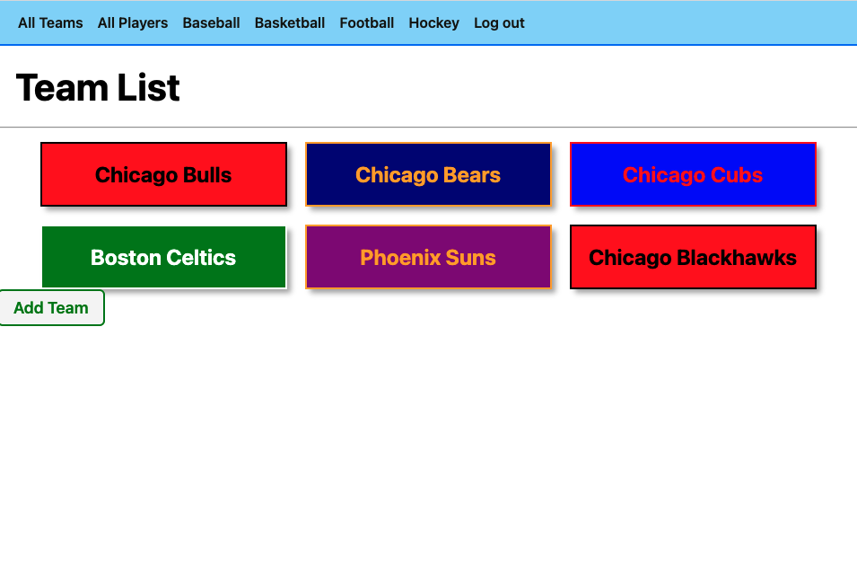
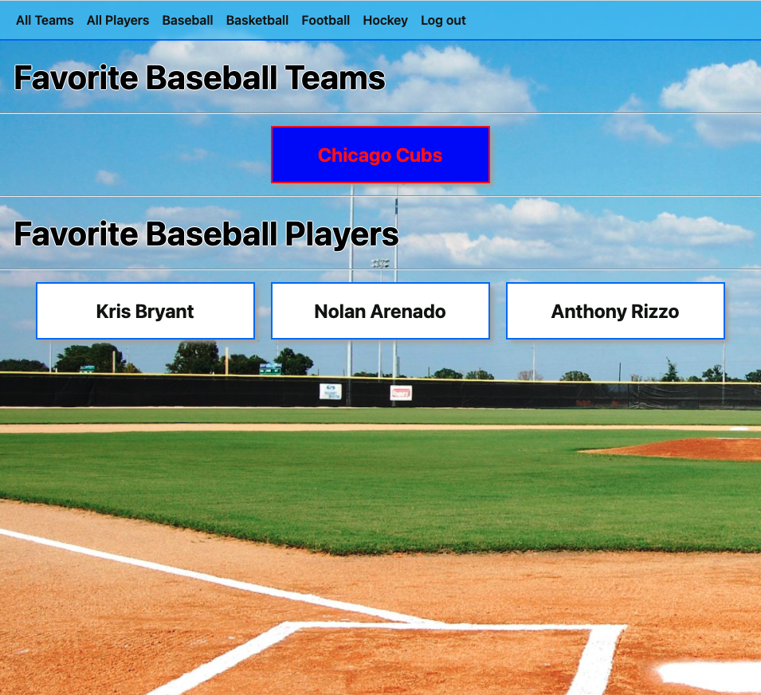
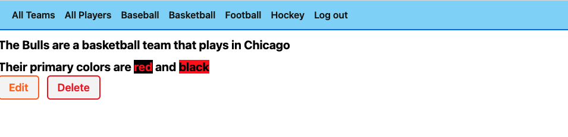
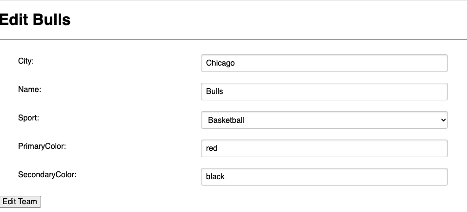
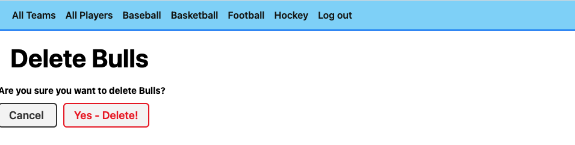

# [Top Athletes](https://topathletes.herokuapp.com/)

Top Athletes is an interactive site that allows you to show how big a sports fan you are. You can set all your favorite teams and players, keeping them all in one place

## Getting Started

1. [Launch the app](https://topathletes.herokuapp.com/)
2. Sign up
3. Start getting your list of teams and players together

Check out the planning steps here:
[Trello project board](https://trello.com/b/MzMYoPZ0/top-athletes).

## Screenshots

break

## Technologies Used

- Python
- HTML
- CSS

For a full list of dependencies please view the [requirements.txt](https://github.com/yoni1994/topathletes/blob/main/requirements.txt).

## Next Steps

- Add more efficient models
- Add more features
- Clean up UI

